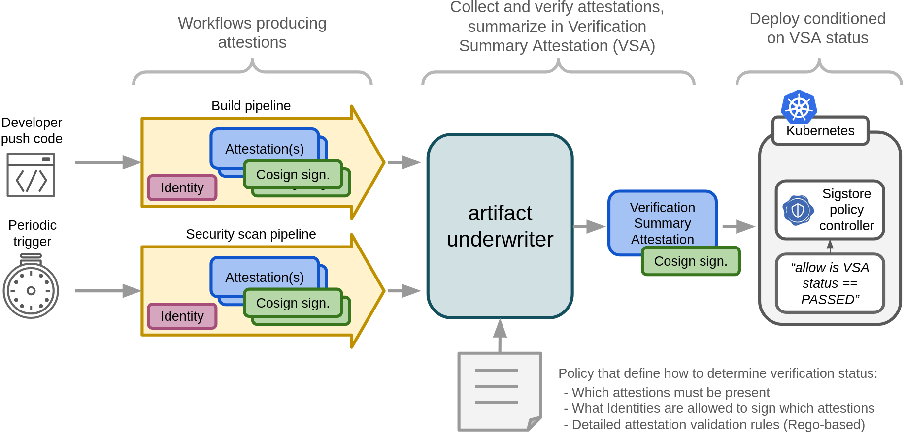

# Artifact Underwriter

:construction: This tool is a PoC. Don't use it for production use-cases.

`artifact-underwriter` is the governance link between workflows that
produce [in-toto attestation
predicates](https://github.com/in-toto/attestation/tree/main/spec/predicates)
signed using [cosign](https://github.com/sigstore/cosign) and
consumers of artifacts such as a Kubernetes [sigstore policy
controller](https://docs.sigstore.dev/policy-controller/overview),
where the consumers should be agnostic to organisation policies -
aka. 'delegated verification'. This is summarised in the illustration
below:



## Overview

`artifact-underwriter` allows governance policies to be defined as
illustrated below. This basically define how to verify attestations.

```yaml
apiVersion: v1alpha1
kind: OciPolicy

steps:
- name: container-build
  attestations:
  - type: https://slsa.dev/provenance/v0.2
  - type: https://spdx.dev/Document
  - type: https://github.com/michaelvl/gha-reusable-workflows/pr-provenance
  functionaries:
  - type: fulcio
    certificate:
      identityRegexp: "https://github.com/michaelvl/gha-reusable-workflows/.github/workflows/container-build-push.yaml@refs/.*"
      oidcIssuer: https://token.actions.githubusercontent.com
```

...TODO

```shell
artifact-underwriter evaluate-policy ghcr.io/michaelvl/sigstore-in-toto-workshop:latest \
  --policy examples/container-policy.yaml \
  --output-vsa vsa.json
```


Finally, `artifact-underwriter` can summarize the governance status
through a [verification summary
attestation (VSA)](https://slsa.dev/spec/v1.0/verification_summary):

```yaml
{
  "predicateType": "https://slsa.dev/verification_summary/v1",
  "subject": [
    {
	  ... which artifact was verified
    }
  ],
  "predicate": {
    "policy": {
	  ... what policy was used to verify
    },

	... summary of the verification
    "slsaVersion": "1.0",
    "timeVerified": "2024-02-10T16:11:33+00:00",
    "verificationResult": "PASSED",
    "verifiedLevels": [
      "SLSA_BUILD_LEVEL_3"
    ],
  }
}
```

This VSA can be used to e.g. control which container images may be
deployed to a Kubernetes cluster through [Sigstore
policy-controller](https://github.com/sigstore/policy-controller)
using e.g. the following `ClusterImagePolicy`.

Note how the VSA provide abstraction of the governance policies and
the `ClusterImagePolicy` only verifies that verification was `PASSED`
at SLSA level 3 within the last 48 hours.

```yaml
apiVersion: policy.sigstore.dev/v1beta1
kind: ClusterImagePolicy
metadata:
  name: repo-michaelvl-sigstore-in-toto-workshop
spec:
  mode: enforce
  images:
    - glob: "ghcr.io/michaelvl/sigstore-in-toto-workshop@**"
  authorities:
  - name: keyless
    keyless:
      url: https://fulcio.sigstore.dev
      identities:
       - issuer: https://token.actions.githubusercontent.com
         subjectRegExp: "https://github.com/michaelvl/gha-reusable-workflows/.github/workflows/policy-verification.yaml@refs/.*"
    ctlog:
      url: https://rekor.sigstore.dev
    attestations:
    - name: organisation-vsa
      predicateType: "https://slsa.dev/verification_summary/v1"
      policy:
        type: rego
        data: |
          package sigstore
          default isCompliant = false
          isCompliant {
            (time.parse_rfc3339_ns(input.predicate.timeVerified) + time.parse_duration_ns("48h")) > time.now_ns()
            input.predicate.verificationResult == "PASSED"
            slsa_level := input.predicate.verifiedLevels[_]
            slsa_level == "SLSA_BUILD_LEVEL_3"
          }
```

## References

This tool is inspired by
[in-toto/witness](https://github.com/in-toto/witness) and
[liatrio/gh-trusted-builds-attestations](https://github.com/liatrio/gh-trusted-builds-attestations)
