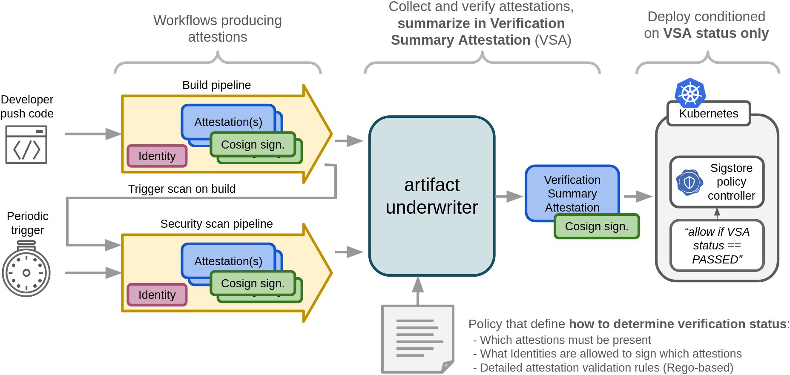

# Artifact Underwriter

:construction: This tool is a PoC. Don't use it for production use-cases.

`artifact-underwriter` is the governance link between workflows that
produce [in-toto attestation
predicates](https://github.com/in-toto/attestation/tree/main/spec/predicates)
signed using [cosign](https://github.com/sigstore/cosign) and
consumers of artifacts such as a Kubernetes [sigstore policy
controller](https://docs.sigstore.dev/policy-controller/overview),
where the consumers should be agnostic to organisation policies and
the verification should be abstracted using the [in-toto Verification
Summary Attestion](https://slsa.dev/spec/v1.0/verification_summary) (VSA) -
aka. 'delegated verification'. This is summarised in the illustration
below:



## Underwriter?

The name of `artifact-underwriter` is derived from the role in
e.g. banking/insurance, where an underwriter is a person that
evaluates various documents and statements prior to e.g. issuing a
loan or an insurance. The process of evaluating documents from various
sources with the aim of producing a 'risk' evaluation matches well
with how `artifact-underwriter` collects attestations, verifies their
provenance through signatures, applies additional policies and produce
a final verification summary attestation.

## Getting Started

A governance policy is a declaration of which attestations are needed
from which identities and which additional verification should be
performed on the statements to issue a 'PASSED' verification
summary. E.g.:

- A SLSA provenance, SBOM and vulnerability scan attestations must be present
- The attestations must be issued by the identity 'github.com/example/workflow'
- Additionally these checks should pass:
  * The vulnerability scan must be created within the last 48 hours
  * The vulnerability scanner version must be > xx.

While `cosign verify-attestation` comes close to provide such
verification it does not produce a VSA or support multiple
combinations of attestations and identities.

With `artifact-underwriter` governance policies can be defined as
illustrated below (partly inspired by [in-toto witness
policies](https://github.com/in-toto/witness)):

```yaml
apiVersion: v1alpha1
kind: OciPolicy

steps:
- name: container-build
  attestations:
  - type: https://slsa.dev/provenance/v0.2
  - type: https://spdx.dev/Document
  - type: https://github.com/michaelvl/gha-reusable-workflows/pr-provenance
  functionaries:
  - type: fulcio
    certificate:
      identityRegexp: "https://github.com/michaelvl/gha-reusable-workflows/.github/workflows/container-build-push.yaml@refs/.*"
      oidcIssuer: https://token.actions.githubusercontent.com

  # More steps are allowed - allowing multiple combinations of attestations and identities

# Policies (Rego) used to apply additional verification of attestations
policy:
  rego:
    path: examples/policy/governance.rego
```

Given an OCI reference and a policy as shown above,
`artifact-underwriter` can create a VSA:

```shell
artifact-underwriter evaluate-policy ghcr.io/michaelvl/sigstore-in-toto-workshop:latest \
  --policy examples/container-policy.yaml \
  --output-vsa vsa.json
```

Which will produce the [verification summary
attestation](https://slsa.dev/spec/v1.0/verification_summary):

```yaml
{
  "predicateType": "https://slsa.dev/verification_summary/v1",
  "subject": [
    {
      ... which artifact was verified
    }
  ],
  "predicate": {
    "policy": {
      ... what policy was used to verify
    },

    ... summary of the verification
    "verificationResult": "PASSED",
    "verifiedLevels": [
      "SLSA_BUILD_LEVEL_3"
    ],
  }
}
```

This VSA can be used to e.g. control which container images may be
deployed to a Kubernetes cluster through [Sigstore
policy-controller](https://github.com/sigstore/policy-controller)
using e.g. the following `ClusterImagePolicy`.

Note how the VSA provide abstraction of the governance policies and
the `ClusterImagePolicy` only verifies that verification was `PASSED`
at SLSA level 3 within the last 48 hours. This is an example of a
'delegated verification'.

```yaml
apiVersion: policy.sigstore.dev/v1beta1
kind: ClusterImagePolicy
metadata:
  name: repo-michaelvl-sigstore-in-toto-workshop
spec:
  mode: enforce
  images:
    - glob: "ghcr.io/michaelvl/sigstore-in-toto-workshop@**"
  authorities:
  - name: keyless
    keyless:
      url: https://fulcio.sigstore.dev
      identities:
       - issuer: https://token.actions.githubusercontent.com
         subjectRegExp: "https://github.com/michaelvl/gha-reusable-workflows/.github/workflows/policy-verification.yaml@refs/.*"
    ctlog:
      url: https://rekor.sigstore.dev
    attestations:
    - name: organisation-vsa
      predicateType: "https://slsa.dev/verification_summary/v1"
      policy:
        type: rego
        data: |
          package sigstore
          default isCompliant = false
          isCompliant {
            (time.parse_rfc3339_ns(input.predicate.timeVerified) + time.parse_duration_ns("48h")) > time.now_ns()
            input.predicate.verificationResult == "PASSED"
            slsa_level := input.predicate.verifiedLevels[_]
            slsa_level == "SLSA_BUILD_LEVEL_3"
          }
```

## Rego Policies

`artifact-underwriter` will fetch and verify signatures on all
attestations as specified in the policy. Next, it will pass the
attestation bundle to Open Policy Agent as `input`. The pass/no-pass
status of the Rego policy evaluation is determined by the query
`data.governance.allow` against the OpenPolicyAgent output.

A simple Rego policy could thus be (see [`examples/policy/governance.rego`](examples/policy/governance.rego)):

```rego
package governance

default allow = false

# Collect all provenance attestions
provenance_attestations := [input[i] | input[i].predicateType == "https://slsa.dev/provenance/v0.2"]

...

# Check for violations in provenance attestations - this is a simple check for presence of provenance
provenance_violations[msg] {
    count(provenance_attestations) == 0
    msg:= "no provenance attestation"
}

# Produce final verdict by combining all checks
allow {
    violations := provenance_violations | sbom_violations | vuln_violations | pr_violations
    print(violations)
    count(violations) == 0
}
```

## Credits and References

- This tool is inspired by
[in-toto/witness](https://github.com/in-toto/witness) and
[liatrio/gh-trusted-builds-attestations](https://github.com/liatrio/gh-trusted-builds-attestations)

- [in-toto/attestation-verifier](https://github.com/in-toto/attestation-verifier)
might evolve into something similar to `artifact-underwriter`.

- [in-toto PR 'Add an attestation for policy verification'](https://github.com/in-toto/attestation/pull/295)

- An end-to-end example usage of this tools can be found in
  [michaelvl/sigstore-in-toto-workshop](https://github.com/michaelvl/sigstore-in-toto-workshop)
  (example application starter workflow) and
  [michaelvl/gha-reusable-workflows](https://github.com/michaelvl/gha-reusable-workflows)
  (trusted workflows that produce VSA).
